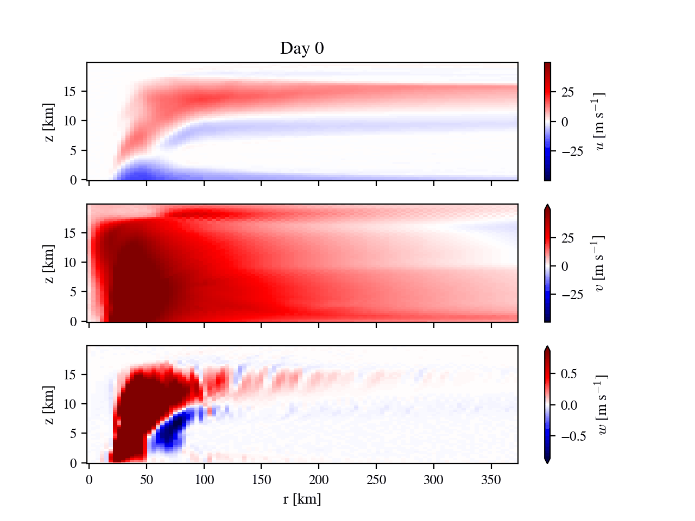

# rotunno87
<a href="https://opensource.org/licenses/MIT"></a>
 <a href="https://github.com/psf/black"></a>

## Purpose

A repository to contain and analyse the code from:

_Rotunno 1987_

<https://doi.org/10.1175/1520-0469(1987)044<0542:AAITFT>2.0.CO;2>


### Summary of paper:

- There is a nice azimuthally symetric model of a tropical cyclone.

- It works well, and vindicates the potential insensity
 theory suggested by part I of this work.

### Citation:

The citation for this paper is:

```bibtex
@article{Rotunno1987,
   abstract = {In Part I of this study an analytical model for a steady-state tropical cyclone is constructed on the assumption that boundary-layer air parcels are conditionally neutral to displacements along the angular momentum surfaces of the hurricane vortex. The reversible thermodynamics implied by this assumption allows the mature storm to be thought of as a simple Carnot engine, acquiring heat at the high-temperature ocean surface and losing heat near the low-temperature tropopause. Although the oceanic heat source is universally recognized as the sine qua non for the mature hurricane, there is also wide acceptance of conditional instability of the second kind (CISK) (which makes no specific reference to surface heat fluxes) as the formative mechanism. This ambivalence is seen in that all numerical-simulation studies find it essential to have transfer from the ocean surface yet all start from a conditionally unstable atmosphere. The hypothesis put forward in Part I, based on the steady-state theory, is that the truly important thermodynamic interaction, even in the developing star, is between vortex and ocean (as distinct from vortex and convection sustained by preexisting conditional instability as in the CISK theory) with cumulus convection rapidly redistributing heat acquired at the oceanic source upward and outward to the upper tropospheric sink. On this view, it is not the organization of convection that is needed per se, but the organization of surface heat flux. We have constructed a time-dependent nonhydrostatic axisymmetric numerical model with convection explicitly accounted for to examine this idea. The numerical experiments show that as a result of a finite-amplitude air-sea interaction instability a hurricane-like vortex may indeed amplify in an atmosphere which is neutral to cumulus convection and attain an intensity and structure which are in excellent agreement with the theoretical predictions of Part I. We examine in detail the model's heat budget which confirms the crucial importance of boundary-layer processes in controlling the structure and evolution of the vortex. We also confirm the conjecture made in Part I that, within a large-scale limit, the horizontal size of the mature tropical cyclone is determined by that of the initial disturbance.},
   author = {Richard Rotunno and Kerry A Emanuel},
   doi = {10.1175/1520-0469(1987)044<0542:AAITFT>2.0.CO;2},
   issue = {3},
   journal = {Journal of Atmospheric Sciences},
   month = {2},
   pages = {542-561},
   title = {An Air–Sea Interaction Theory for Tropical Cyclones. Part II: Evolutionary Study Using a Nonhydrostatic Axisymmetric Numerical},
   volume = {44},
   url = {https://journals.ametsoc.org/view/journals/atsc/44/3/1520-0469_1987_044_0542_aaitft_2_0_co_2.xml},
   year = {1987},
}

```

## Example model run

